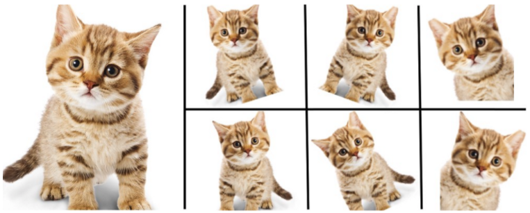
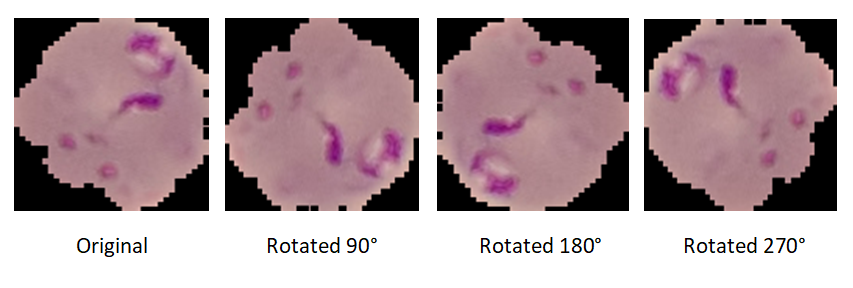
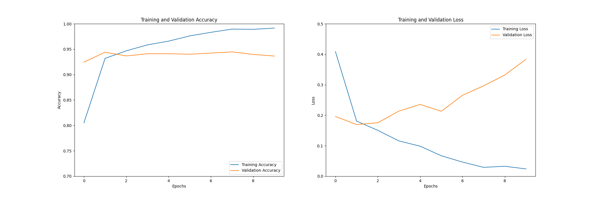
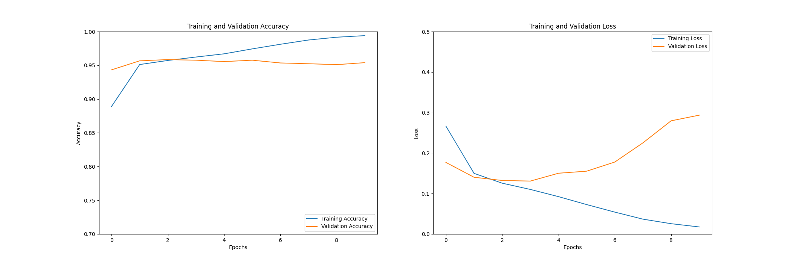

# Data Augmentation
Data augmentation is a technique to increase the diversity of data and number of samples within a dataset. This can be achieved through many different methods such as:

* Flipping
* Rotation
* Translation
* Scaling
* Altering brightness/contrast/hue…

Other approaches can be utilised, however, the methods above are the most frequently used. Figure 1 shows how an image may be manipulated using data augmentation.

*Figure 1:  A data augmentation example.*

Source: [KDnuggets](https://www.kdnuggets.com/2018/05/data-augmentation-deep-learning-limited-data.html)

I applied data augmentation to my dataset as providing more samples to a CNN is a means of reducing the effects of overfitting. Although to the human eye the images may look very similar, a computer reads the data as being different. Specifically, for the malaria dataset, I decided to rotate each image 3 different times. This left me with 4 images instead of 1 as seen in figure 2. To do this I used the Python PIL (Python Imaging Library) library to rotate the images and save them to a set directory. Please find the code [here](../../dataset/augment_data.py). Each image could have been augmented further; this was unnecessary as all the images have very similar features and the dataset is already very large. The number of images in the training partition increased from 17,638 (original) to 70,552 (augmented). It should be noted that data augmentation is only applied to a training set and not the validation or testing set. This is vital as testing should only take place with real samples.

*Figure 2: A data augmentation example using the malaria dataset.*

### Using data augmentation with a CNN
To investigate how well data augmentation works at improving the model accuracy, and at reducing the effects of overfitting, I trained the colour CNN model with the augmented data. To conduct a fair comparison, I have kept the CNN architecture the exact same; the only altered parameter was the inputted dataset. As seen in the difference between figure 3 and 4, I found that using data augmentation caused the validation loss to increase at a slower rate. This means that the effects of overfitting have been reduced. Although there is not a vast difference between the loss values, the validation accuracy increased by 1.7 from 93.6% to 95.3%. This is a vast improvement when accuracy has already surpassed 90%. Due to this being an improvement on the previous model, I have used data augmentation to train all the future CNN models.

*Note: all graphs start at epoch 0 (e.g. epoch 1 is 0 on the graph).*

*Figure 3: Original colour CNN model.*

*Figure 4: Data augmented colour CNN model.*

As seen in figure 4 the model seems to overfit very quickly after less than 5 epochs. Although early stopping could be used, I was curious if loss would decrease (and accuracy increase) after a large number of epochs. Therefore, I trained the same original colour model with 100 epochs. I could have trained the model with more epochs, however, I believe 100 epochs was enough to be sure there would be no drastic changes later in training. As seen in figure 5, loss increased, and my predictions were correct. 

*Figure 5: Data augmented colour CNN model with 100 epochs.*

[Return to 'README.md'](../../README.md)
