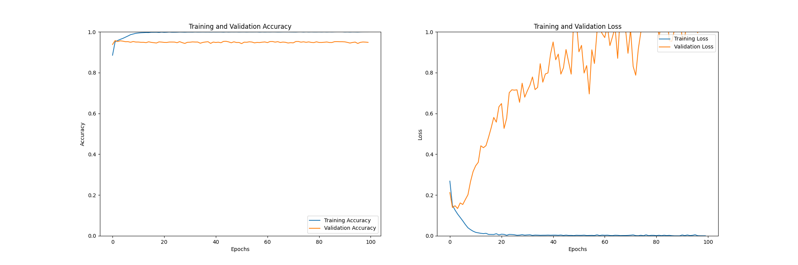
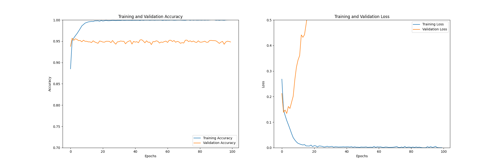
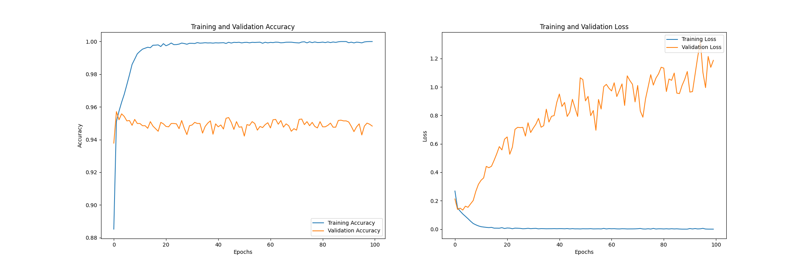
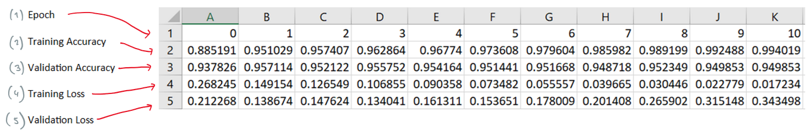

# Data Visualisation
I found that trying to identify issues with a models training was difficult, especially as I only had access to a collection of figures. These were laid out as found in figure 1. Consequently, I utilised Matplotlib to create a range of line graphs that would better represent the data. Furthermore, overfitting and underfitting is very clear when represented on a graph. The code can be found in any model from ‘[colour_model_1](../colour_model_1/colour_model_1.py)’ and onwards.

*Figure 1: Training output from the greyscale CNN.*

Each output using Matplotlib contained 2 different graphs. One graph visualised the change in training accuracy and validation accuracy. Whereas the other visualised the change in training loss and validation loss (see examples via figures 2/3/4). To ensure I had different perspectives of the data, I created 3 different outputs. The *y* axis of the first output is unconstrained from 0-1 for both graphs (see figure 2). The accuracy graph of the second output is constrained from 0.7-1, and the loss graph is constrained from 0-0.5 (see figure 3). Finally, the graphs from the last output scale automatically to display as much detail as possible, whilst keeping all the data in the frame (see figure 4). It should be noted that the *x* axis automatically scales with the number of epochs. Furthermore, I outputted a CSV file with all the relevant data so I could create any other graphs post-training. This also enables me to find the exact training values in the future. I have annotated how the data is laid out in figure 5.

*Figure 2: Unconstrained scaling (0-1).*

*Figure 3: Example graphs scaled at 0.7-1 (left) and 0-0.5 (right).*

*Figure 4: Example graphs with automatic scaling.*

*Figure 5: CSV file layout.*

[Return to 'README.md'](../../README.md)
