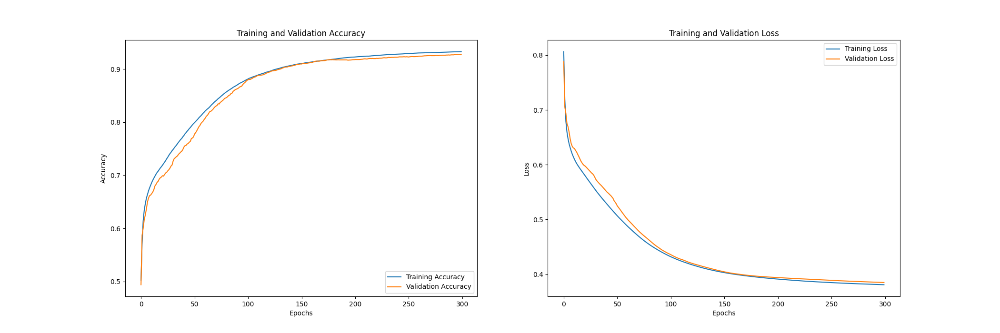

# Discussion
With both final model accuracies over 95%, I can be assured that I achieved my main aim of surpassing the RDT’s diagnostic accuracy of only 79%. While I believe this is a good improvement, I believe that the accuracy would need to surpass at least 98% (1 in 50 false diagnostics) to be part of a viable testing method within laboratories. With more time, I believe that the model’s accuracy could exceed 98%. This would be done using other popular techniques or expanding on the techniques that have already been used. For instance, data augmentation could be further explored, or custom convolutional layers could be designed based on state-of-the-art.

The NIH proposed a custom model and reviewed state-of-the-art CNN architectures [1]. I wanted to compare the accuracy scores with these models. Initially, I trained the proposed NIH CNN as found in the source code [2]. This was to ensure that the model was tested in the same way, with the same data. Despite this, when training the model, I came across some issues. The model only managed to reach ~0.92 validation accuracy with the stated 300 epochs (the model seemed to have a slow learning rate). As seen from figure 1, the model’s validation accuracy looks to be increasing even after 300 epochs, so most likely would achieve a much higher accuracy score. However, with my current hardware, it would most likely take at least a week to train, so would be impractical. Consequently, the comparisons made below (figure 2) are not exact comparisons, as the accuracy scores are computed differently, on a different randomised partition of the dataset. Although there are differences in testing, I believe the comparison below gives a good indication of the model’s success. My model’s accuracy vastly improved on some of those compared in figure 2. Moreover, although some models score ~0.02 more than my model, as the models are tested differently, it's highly probable that the accuracies are more similar than it seems. This is because the testing data may favour a particular model.

*Figure 1: NIH customised CNN model training output.*

*Figure 2: Accuracy comparison with state-of-the-art.*

| Model/Method | Accuracy |
|---|---|
| My Custom Model | 0.962 Validation (0.956 Test) |
| NIH Proposed Model | 0.986 |
| Gopakumar et al. (2018) | 0.977 |
| Bibin, Nair & Punitha (2017) | 0.963	|
| Dong et al. (2017) | 0.981 |
| Liang et al. (2017) | 0.973 |
| Das et al. (2013) | 0.840 |
| Ross et al. (2006) | 0.730 |

*Accuracy comparisons are made using data from an NIH paper* [1].

### References
[1] S. Rajaraman, S. K. Antani, M. Poostchi, K. Silamut, M. A. Hossain, R. J. Maude, S. Jaeger and G. R. Thoma, “Pre-trained convolutional neural networks as feature extractors toward improved malaria parasite detection in thin blood smear images,” PeerJ, 16 April 2018. 

[2] S. Rajaraman, “CNN-for-malaria-parasite-detection,” [Online]. Available: [GitHub](https://github.com/sivaramakrishnan-rajaraman/CNN-for-malaria-parasite-detection). [Accessed 1 April 2021].

[Return to 'README.md'](../../README.md)
