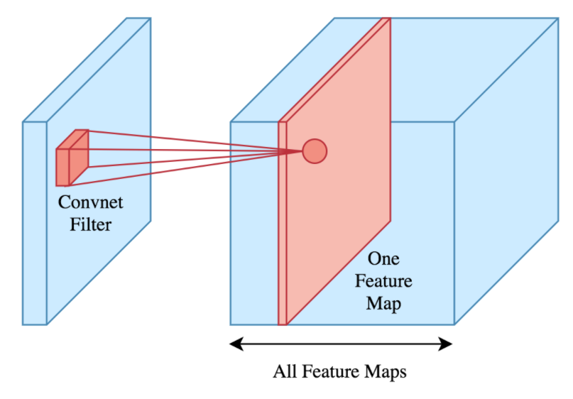

# Feature Map Visualisation
Feature maps are used to visualise how input images are transformed when passed through a Convolutional Neural Network. They highlight the key areas that the filters identify. Figure 1 shows where the feature maps originate from within a CNN. I visualised how my final CNN model identifies the malaria parasites in a red blood cell. Figures 2, 3 and 4 visualise parasitized cell feature maps and figure 5 visualises a healthy example. This was done to check that the right areas were being identified and no extra pre-processing was required. As seen from figures 2, 3 and 4, the malaria parasites in the red blood cells were recognised as desired. Please find the code that was used to visualise the feature maps [here](/visualisation/visualise_feature_maps.py).

*Figure 1: Feature map origin.*

Source: [towardsdatascience](https://towardsdatascience.com/applied-deep-learning-part-4-convolutional-neural-networks-584bc134c1e2#9722)

*Figure 2: Feature maps of a parasitized cell ('parasitized' example 1).*

*Figure 3: Feature maps of a parasitized cell ('parasitized' example 2).*

*Figure 4: Feature maps of a parasitized cell ('parasitized' example 3).*

*Figure 5: Feature maps of a healthy cell ('healthy' example 1).*

[Return to 'README.md'](../../README.md)
