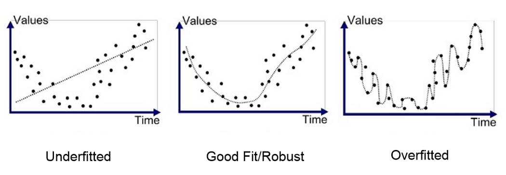

# Improving the Model
When training the initial colour model, I found that the validation loss was exponentially increasing after only 2/3 epochs. This generally occurs due to overfitting. Overfitting takes place when the model fits to the training data too well; find an example in figure 1 below. Consequently, the model cannot identify general patterns and instead only recognises very specific features. To reduce the effects of overfitting, and to improve the model’s accuracy, I utilised a variety of techniques. The techniques used and their explanations can be found by visiting their documentation:

* [Data Visualisation](models/docs/data_visualisation.md)
* [Data Augmentation](models/docs/data_augmentation.md)
* [Regularisation](models/docs/regularisation.md)
* [Optimizer Adjustment](models/docs/optimizer.md)
* [Feature Map Visualisation](models/docs/feature_maps.md)

*Figure 1: Visual representation of overfitting and underfitting to data.*

Source: [Medium]( https://medium.com/greyatom/what-is-underfitting-and-overfitting-in-machine-learning-and-how-to-deal-with-it-6803a989c76)

[Return to 'README.md'](../../README.md)
