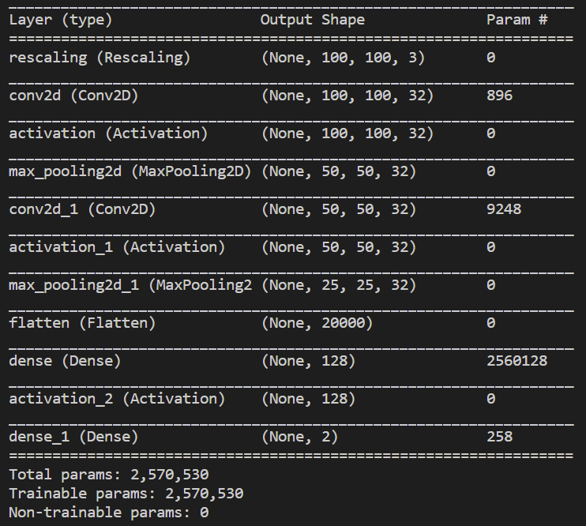
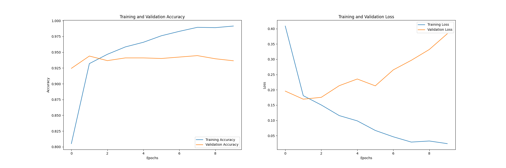
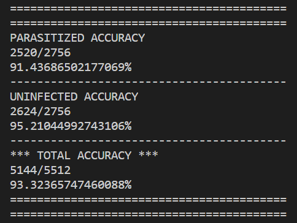

# Initial Colour Model
The previous CNN model, which processes greyscale images, had excellent validation accuracy (~94%), but very poor test accuracy (~71.4%). Due to this poor accuracy score I decided that I needed to make vast improvements to my model. The clear first step was to use all the image’s data (the original RGB images), instead of converting to greyscale. This is because a coloured image (RGB) has 3x the amount of data compared to a greyscale image. For instance, a greyscale image has different levels of grey, from black (0) to white (255), for each pixel. Whereas, an RGB (coloured) image has different levels of red, green, and blue for each pixel in the range 0-255. This results in a greyscale pixel only storing 1 value (e.g. 210) and an RGB pixel storing 3 values (e.g. 248, 100, 143).

*Any of the following code discussed can be found here: [original_colour_model.py](../original_colour_model/original_colour_model.py)*

To aid my learning on implementing a CNN that inputs RGB images, I referred to a [TensorFlow guide](https://www.tensorflow.org/tutorials/images/classification). As the images are in colour, minimal pre-processing is required, however, the images still need to be loaded and resized. To do this Keras has a useful method, `tf.keras.preprocessing.image_dataset_from_directory`, which automatically pulls in a local dataset and can perform actions such as resizing. For example: 

```
training_dataset = tf.keras.preprocessing.image_dataset_from_directory(
    directory=TRAIN_DATA, 
    batch_size=BATCH_SIZE,
    image_size=(IMG_DIMENSION, IMG_DIMENSION)
)

validation_dataset = tf.keras.preprocessing.image_dataset_from_directory(
    directory=VAL_DATA,
    batch_size=BATCH_SIZE,
    image_size=(IMG_DIMENSION, IMG_DIMENSION)
)
```

Once the data was imported, I built the model architecture. The model has a very similar architecture to the ‘[Initial Greyscale Model](initial_greyscale.md)’ and can be found below in figure 1. The main difference is that I used a different loss function, named sparse categorical cross-entropy, which is used when there are 2+ classes. Ideally, binary cross-entropy would be used as there are only 2 classes, parasitized and infected. However, I came across issues when deploying the model with binary cross-entropy. Thus, temporarily, I decided to use sparse categorical cross-entropy instead. 

*Figure 1: Initial colour model architecture.*



### Training
I trained this model for 16 epochs, however, the model could have ideally been stopped after 3. This is because at the third epoch validation accuracy was high, and the validation loss was at its lowest (see figure 2). After the third epoch validation loss increased exponentially, which is generally a cause of overfitting. Find out about overfitting and what can be done to prevent it [here](improving_model.md).

*Figure 2: A visualisation of the training process using different types of accuracy and loss. Epochs start at 0 in the graph, similarly to indexing (e.g. epoch 3 is 2 on the graph). Please note that this graph was created after I designed and implemented this model. I did not use these visualisations until the second colour model. Find out how these were designed and utilised [here](data_visualisation.md).*



### Testing
As creating the first CNN colour model was a big milestone in the project, I decided to test its accuracy on unseen samples. The accuracy has vastly improved from the previous model (see figure 3) which only achieved 71.4% (greyscale model). 

*Figure 3: Testing accuracy from the initial colour model.*



[Return to 'README.md'](../../README.md)
