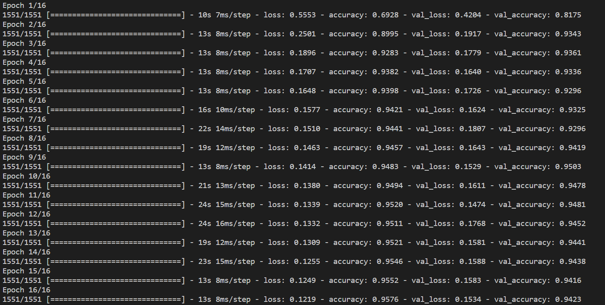
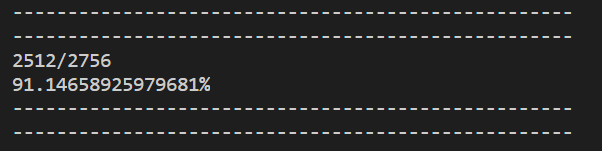
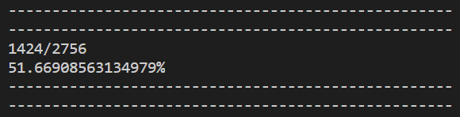

# Initial Greyscale Model
When designing the first CNN model for malaria classification, I decided to base the code and architecture on the practice CNN. Consequently, I will summarize this model as some of the information discussed here is similar to ‘[Implementing a CNN](../../practice/docs/implementing.md)’. Please refer to any of the code discussed [here](../original_greyscale_model).

To prepare the dataset I used OpenCV to resize the images to 50x50 pixels and converted them all from colour (RGB) to greyscale. Following this, I saved the prepared dataset to feature (X) and label (y) pickle files to allow for quick reuse when training a new model. Once the data was prepared, the model was created using the Keras and TensorFlow libraries. The model that was built had the following architecture:

* `Conv2D(64, (3,3))` - The ‘64’ refers to the number of output filters in the convolution and ‘3, 3’ refers to the kernel size (convolutional window).
* `Activation('relu')`
* `MaxPooling2D(pool_size=(2,2))` - The ‘2, 2’ refers to the window size for max pooling.
* `Conv2D(64, (3,3))`
* `Activation('relu')`
* `MaxPooling2D(pool_size=(2,2))`
* `Flatten()`
* `Dense(64)`
* `Dense(1)` - The output requires 1 dimensional data.
* `Activation('sigmoid')` - The sigmoid activation function translates an input to between 0-1.

The other notable chosen parameters were:
* Optimizer: `adam` 
* Loss Function: `binary cross-entropy`
* Batch Size: `32`
* Epochs: `16`

### Training
As expected, validation accuracy needs to be maximised, however, loss in general needs to be minimised. Loss is a method of evaluating how well an algorithm models a given dataset. If loss unexpectedly increases, this is generally due to overfitting. Overfitting occurs when the model tries to ‘fit’ to the training data and cannot generalise very well on unseen test examples. As seen in figure 1 below, the model achieved approximately 94% validation accuracy which is excellent when training a model for the first time. Additionally, validation loss decreased as desired, however, the ideal stopping point would have been at the 11th epoch as validation loss was at its lowest.

*Figure 1: Training the greyscale CNN.*

### Testing
To test how well the model is likely to perform with a real-world scenario, I used a test set, which is 20% of the original dataset. I partitioned the dataset before training so the same images were not tested on. This is done to find out how well the model can generalise on unseen samples. The model achieved an overall accuracy of 71.4% (3936/5512 correctly predicted), however, please find the individual accuracies in figure 2/3 below. As seen from figures 2/3, the model was very biased towards a parasitized classification. This resulted in the model making poor predictions when trying to classify healthy samples.

*Figure 2: Parasitized sample accuracy.*

*Figure 3: Healthy sample accuracy.*

[Return to 'README.md'](../../README.md)
