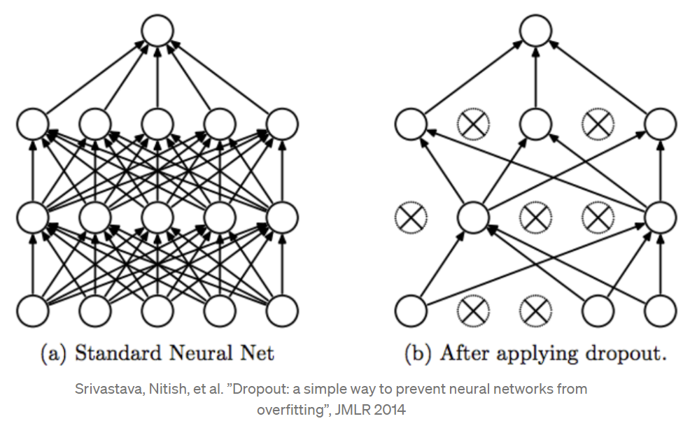

# Regularisation
Another method of reducing the effects of overfitting in a CNN is regularisation. Regularisation lowers the complexity of a neural network during training. Thus, the model can generalise better. A frequently used form of regularisation is dropout. Dropout is a technique where with a set probability, a neuron in a neural network gets turned off during training ([towardsdatascience]( https://towardsdatascience.com/regularization-in-deep-learning-l1-l2-and-dropout-377e75acc036)). Please see figure 1 for a visual example.

*Figure 1: Visual example of dropout.*

Source: [Medium](https://medium.com/@amarbudhiraja/https-medium-com-amarbudhiraja-learning-less-to-learn-better-dropout-in-deep-machine-learning-74334da4bfc5)

### Dropout Investigations
I applied different dropout probability values to my model for 2 reasons. Firstly, to identify if dropout would improve the model’s accuracy; secondly, to reduce the effects of overfitting. The related code for these experiments is labelled ‘colour_model_2’ and can be found [here](../../models/colour_model_2/colour_model_2.py). Dropout is applied after a convolutional layer (or the accompanying sampling & activation functions) when using Keras. I compared the original CNN model with altered copies; these copies included:

* Dropout probability **0.3** and 10 epochs
* Dropout probability **0.5** and 10 epochs
* Dropout probability **0.5** and 25 epochs

The training outputs of these CNN models can be found in figures 2, 3, 4 and 5. I concluded that a dropout probability of 0.5 reduced the effects of overfitting the best. This is because the validation loss did not rapidly increase (compared to the original CNN), which can be visualised the best via figure 5. Due to this favourable outcome, I will use a dropout probability of 0.5 in all future models.

*Note: all graphs start at epoch 0 (e.g. epoch 1 is 0 on the graph).*

*Figure 2: Custom CNN model with 10 epochs (original).*
* Validation Accuracy (of last epoch): 0.951

*Figure 3: Custom CNN model with 10 epochs and dropout probability 0.3.*
* Validation Accuracy (of last epoch): 0.953

*Figure 4: Custom CNN model with 10 epochs and dropout probability 0.5.*
* Validation Accuracy (of last epoch): 0.941

*Figure 5: Custom CNN model with 25 epochs and dropout probability 0.5.*
* Validation Accuracy (of last epoch): 0.946

[Return to 'README.md'](../../README.md)
