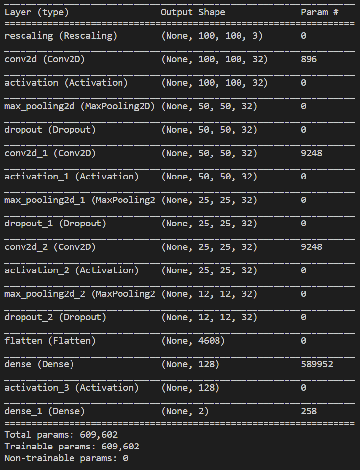

# Evaluation & Results 
Please find the detailed information on these models via section 2, ‘[Designing Custom CNN Models](../../README.md)’, from the technical documentation. I use validation and test accuracy as a way of evaluating my model. Only the milestone CNN models were tested using the test set, as improvements on a model should be based on validation accuracy and not test accuracy. This is to ensure the model can generalise well and doesn’t just fit to a specific case. Please note that the accuracy scores are taken from the last epoch.

Find the data partitions here:
* [Validation Set](../../dataset/augmented/validation_set)
* [Testing Set](../../dataset/augmented/testing_set)

The testing accuracy was calculated using custom Python scripts: [test_accuracy_colour.py](../../testing/test_accuracy_colour.py) and [test_accuracy_greyscale.py](../../testing/test_accuracy_greyscale.py)

## [Original Greyscale Model](/models/original_greyscale_model)

* Validation Accuracy: 0.942
* Test Accuracy: 0.714

## [Original Colour Model](/models/original_colour_model)

* Validation Accuracy: 0.936
* Test Accuracy: 0.933

## [Colour Model 1](/models/colour_model_1) (Augmented Data)

#### Original Colour Model with Augmented Data & 10 Epochs

* Validation Accuracy: 0.953

#### Original Colour Model with Augmented Data & 100 Epochs

* Validation Accuracy: 0.948

#### Original Colour Model with Augmented Data & 3 Epochs (Early Stopping)

* Validation Accuracy: 0.953

*Note: All future models use the augmented dataset and another convolutional layer.*

## [Colour Model 2](/models/colour_model_2) (Dropout & Extra Convolutional Layer)

#### Dropout 0.3 & 10 Epochs

* Validation Accuracy: 0.953

#### Dropout 0.5 & 10 Epochs

* Validation Accuracy: 0.941

#### Dropout 0.5 & 25 Epochs

* Validation Accuracy: 0.946

*Note: All future models use a dropout probability of 0.5 and have an extra convolutional layer (+ReLU, +max pooling).*

## [Colour Model 3](/models/colour_model_3) (Optimizer Adjustment)

#### SGD & 10 Epochs

* Validation Accuracy: 0.949

#### SGD & 100 Epochs

* Validation Accuracy: 0.958

#### SGD & 250 Epochs

* Validation Accuracy: 0.955

#### NIH SGD & 10 Epochs

* Validation Accuracy: 0.523

#### RMSprop & 10 Epochs

* Validation Accuracy: 0.891

*Note: All future models use the SGD optimizer.*

## [Final Model](/models/final)
The final model is taken from the 78th epoch (77th in the [CSV](/models/final/final_model_data.csv)) of ‘Colour Model 3’ which uses the SGD optimizer. The final model architecture is shown in figure 1. 

* Validation Accuracy: 0.962 (**96.2%**)
* Test Accuracy: 0.956 (**95.6%**)

*Figure 1: The final CNN model architecture.*

[Return to 'README.md'](../../README.md)
