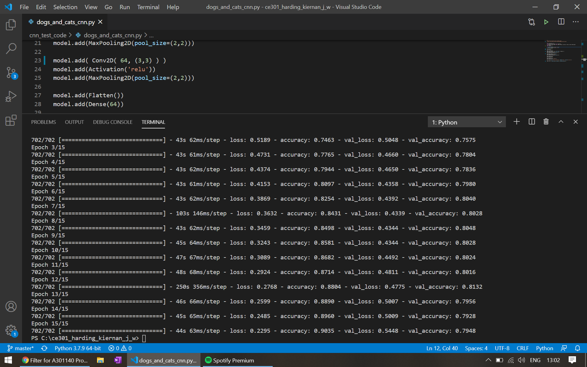

# Implementing a CNN
### Preparing the dataset
As mentioned in ‘[Setting up the Environment](environment.md)’, I have researched many tutorials to aid my understanding of CNNs. Consequently, I decided to utilise a tutorial by ‘[Python Programming Tutorials](https://pythonprogramming.net/convolutional-neural-network-deep-learning-python-tensorflow-keras/?completed=/loading-custom-data-deep-learning-python-tensorflow-keras/)’, which explained how to classify images of dogs and cats using the relevant Kaggle dataset. Although the CNN for malaria testing may require different architecture, I believed that this example would be a vital starting point. Particularly, as I had little Machine Learning and no CNN knowledge prior to this project.

Before implementing the Convolutional Neural Network architecture, the dataset must be prepared. Please refer to the code that will be discussed [here](../practice_cnn_model/dogs_and_cats_img_prep.py). All the images are looped over and resized to a fixed dimension using OpenCV. This is done as a CNN takes input data of the same size. Additionally, all images are converted to greyscale as the CNN that I implement takes a single channel image. While this does mean some of the image’s information is lost, dealing with single channel data is simpler when first implementing a CNN. Once the data has been manipulated appropriately, the images and their labels are added to arrays and outputted to a file using Pickle. This is done so the input data does not need to be manipulated every time prior to training. The Pickle files can be found [here](../practice_cnn_model).

### Building the CNN
Before the model architecture can be built the prepared dataset must be imported using Pickle. This is done by using a Pickle method, `pickle.load()`. Now that the data has been imported, the CNN can be built using TensorFlow and Keras libraries. Please refer to the code discussed [here](../practice_cnn_model/dogs_and_cats_cnn.py). Keras offers a very useful class called ‘[Sequential](https://keras.io/api/models/sequential/)’, which allows for different layers to be added to it using the method `add()`. With a broad understanding of CNN architecture, these libraries allow for models to be implemented and altered relatively fast. Using the `add()` method, I added the following layers to the model:

* `Conv2D(64, (3,3))` - The ‘64’ refers to the number of output filters in the convolution and ‘3, 3’ refers to the kernel size (convolutional window).
* `Activation('relu')`
* `MaxPooling2D(pool_size=(2,2))` - The ‘2, 2’ refers to the window size for max pooling.
* `Conv2D(64, (3,3))`
* `Activation('relu')`
* `MaxPooling2D(pool_size=(2,2))`
* `Flatten()`
* `Dense(64)`
* `Dense(1)` - The output requires 1 dimensional data.
* `Activation('sigmoid')` - The sigmoid activation function translates an input to between 0-1.

Now that the model has been built, it needs to be compiled. I have chosen to use binary cross-entropy as my loss function as there are only 2 classes, and the Adam optimizer as it has a good characteristic balance of the most popular optimizers (AdaGrad & RMSProp).
```
model.compile(loss='binary_crossentropy', optimizer='adam', metrics=['accuracy'])
```

I then needed to fit my model and decide on the parameters. I came across issues when trying to do fit the model originally, but later on found that the input data (X, y) was the wrong type. Instead, the arrays needed to be converted to Numpy arrays. The number of samples inputted per gradient update (batch size) was 32, which is the default for a simplistic model. I chose 10 epochs (an iteration over all the data) for this practice CNN as I didn’t want training to take too long, however, I still wanted to review how accuracy changed over time. Finally, I chose 10% (0.1) of the training data to act as the validation partition when training. Validation data is used to quickly test how well the model is performing on the current epoch.

```
model.fit(X, y, batch_size=32, epochs=15, validation_split=0.1)
```
The output from training can be viewed below (figure 1), but in short, the model managed to reach approximately 0.8 (80%) validation accuracy. I won’t improve on this model as it is just a practice example, however, I will make vast improvements on future models. 

*Figure 1: The training output of my first CNN.*



[Return to 'README.md'](../../README.md)
