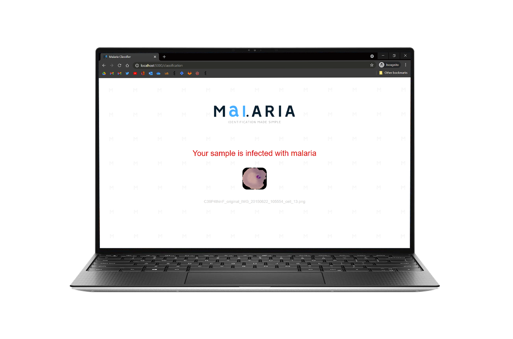

# Application Examples
In this part of the technical documentation, there are example screenshots of how the application works on a computer with a 16:9 screen. There are small details present in the application that can be found when observant. For instance, the favicon logo or the small logos pattern scattered across the application backing. Please find a step-by-step example of how the application works below. 
#### 1. The home page.

#### 2. Choosing the pre-segmented red blood cell to classify.

#### 3. The sample has been selected.

#### 4. The ‘classify’ button has been clicked and the sample is being classified.

#### 5. The classification output for an infected sample.

#### 6. The classification output for a healthy sample.

#### A synthetic moving example.
The GIF below shows what the application may look like when in actual use. Please note that the loading wheel is synthesized and that a real example can be seen via step 4 above. 

[Return to 'README.md'](../../README.md)
