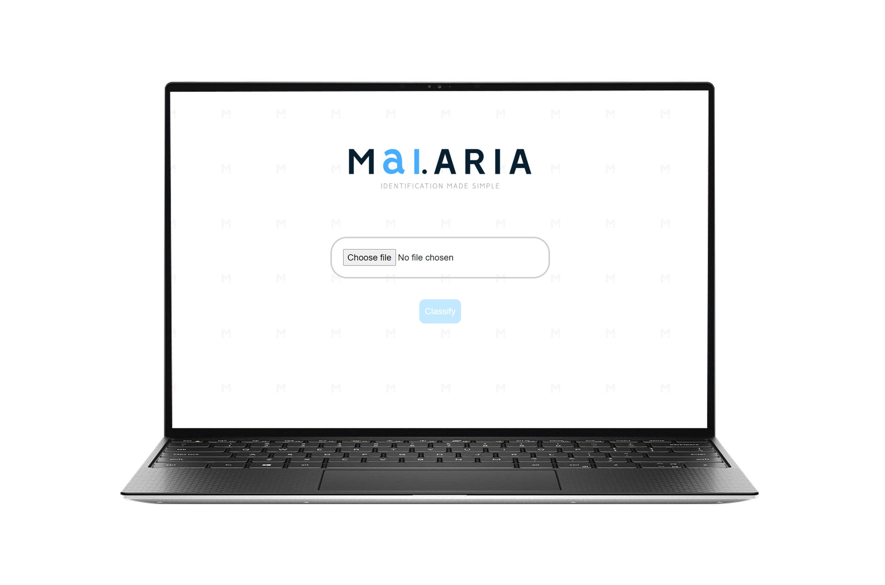
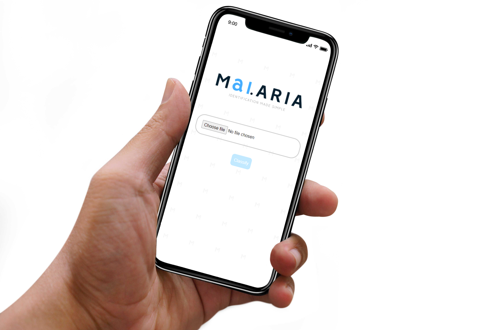
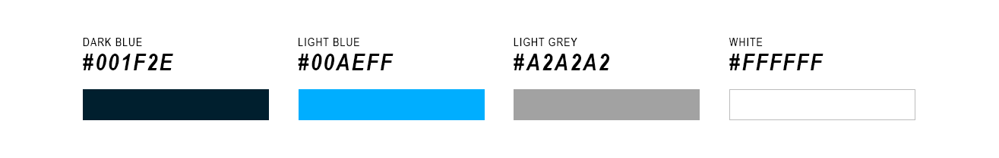

# Styling
When designing the classification app, I ensured that it was simplistic to navigate and use. I believe that it is meaningless to design a website with unnecessary features or cluttered information. Furthermore, as stated in my aims and objectives I wanted the application to be able to be accessed via any device. The custom styling can be found via the CSS file [here](../static/style.css). Furthermore, please find the full visual examples [here](examples.md).

### Bootstrap
I used the Bootstrap framework to increase the application's usability on different devices and increase the aesthetic appeal. When ensuring the application could be used on any device, I found that due to the application’s simple layout, I did not need to overuse Bootstrap. I found that Bootstrap’s CSS classes such as `text_center`, were sufficient in guaranteeing that the website was usable on smaller (mobile), and larger devices (PC). For example, figure 1 visualises the application on a PC, whereas figure 2 shows the application on a mobile device. This was tested manually using Chrome’s inbuilt mobile feature.

*Figure 1: The application visualised on a PC browser.*



*Figure 2: The application visualised on a mobile device.*



I also used Bootstrap and JavaScript to implement a loading wheel, which provides visual feedback to the user when they click (or press) ‘classify’. Furthermore, I used JavaScript to disable the ‘classify’ button, ensuring that the user cannot click the button when no image has been uploaded. When the button is disabled the colour is muted. Please find the full related code via ‘[index.html](../templates/index.html)’ or see a snippet below (figure 3).

*Figure 3: Bootstrap loading wheel and relevant JavaScript.*

```
<div id="loading" class="text-center" style="visibility: hidden">
    <div class="spinner-border" role="status">
        <span class="sr-only"></span>
    </div>
</div>

<script>
    document.getElementById("submit-cell").disabled = true;
    document.getElementById("submit-cell").addEventListener("click", loadingWheel);
    document.getElementById("upload-cell").addEventListener("change", unlockBtn);

    function loadingWheel() {
        document.getElementById("loading").style.visibility = "visible";
    }

    function unlockBtn() {
        document.getElementById("submit-cell").disabled = false;
    }
</script>
```

### Theme & Logo
When designing the application, I sought after a colour theme that was peaceful and serene to the user. This is because the app would likely be used by overworked specialists in a tense environment. Consequently, I avoided colours that related to death and anger, such as red. I decided to use white as the core background and different shades of blue as the primary colours. These colours are generally related to healthcare, which is most likely due to the NHS. The main colours used are shown in figure 4.

*Figure 4: The colour theme used.*



When designing a mock logo, I incorporated AI (Artificial Intelligence) into the disease name ‘Malaria’. This was to clearly indicate its purpose. I created the logo using Adobe’s Photoshop software (see figure 5); Photoshop was used for any graphical designs for this project. Please visit the ‘[imgs](../../imgs)’ folder to locate any of these designs.

*Figure 5: Malaria AI classification tool logo.*


There are many other small design details found in the application, such as the small logos scattered across the background. These details are better visualised by visiting the ‘[examples](examples.md)’ section of the technical documentation. 


[Return to 'README.md'](../../README.md)
